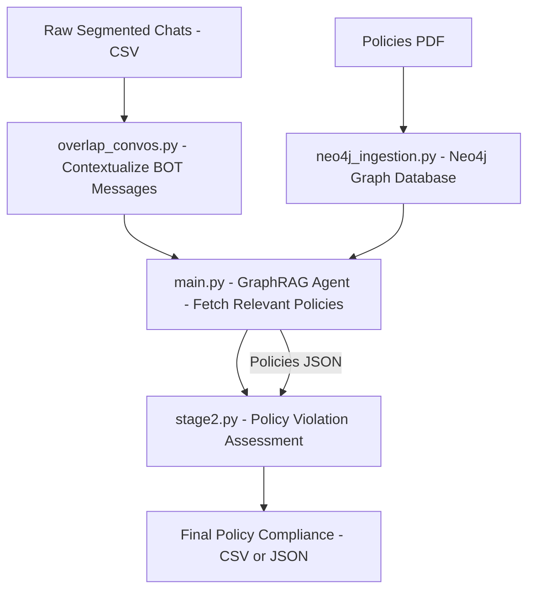

# Policy Compliance Pipeline

This project automates the process of analyzing Doctors (for now) Bot to identify relevant company policies, assess compliance, and flag violations. The workflow is designed to provide context-rich, policy-aware analysis, leveraging advanced AI and graph database technologies.

---

## **Pipeline Overview**



---

## **Step 1: Contextualizing Conversations (`overlap_convos.py`)**

**Input:**
Raw segmented chat logs (CSV) containing conversation IDs, agent names (BOT or human), and messages.

**Process:**

* Groups messages by conversation ID.
* Merges consecutive BOT messages.
* Appends a configurable number of messages from adjacent human agent messages to BOT messages for added context.
* Skips conversations handled only by BOT (keeps only those with both BOT and human agent involvement).
* Fixes garbled text due to encoding issues.

**Output:**
A processed CSV where each BOT message is enriched with relevant context from human agents.

---

## **Step 2: Policy Retrieval with GraphRAG (`main.py` & `graphrag_agent.py`)**

**Input:**
Contextualized conversations from Step 1.

**Process:**

* Sends BOT message (with context) to the GraphRAG agent.
* **GraphRAG Agent:**

  * Uses GPT-4o for semantic understanding.
  * Connects to a Neo4j graph database with policies (ingested via `neo4j_ingestion.py`).
  * Retrieves relevant policies through:

    * **Structured Search:** Neo4j graph traversal.
    * **Unstructured Search:** Semantic (vector) search via OpenAI embeddings.
  * Filters policies by relevance score.
  * Returns structured JSON per conversation:

```json
{
  "policies": [
    {
      "title": "Policy Title",
      "relevance_score": 0.92,
      "excerpt": "Relevant policy excerpt...",
      "exceptions": "Any exceptions or special cases."
    }
  ]
}
```

**Output:**
CSV mapping conversations to relevant policy data in JSON format.

---

## **Step 3: Policy Violation Assessment (`stage2.py`)**

**Input:**
CSV from Step 2.

**Process:**

* Sends conversation and policies to the LLM with a detailed prompt.
* LLM evaluates:

  * Compliance with each policy.
  * Exceptions and special conditions.
  * Violation details.
* Outputs structured JSON per conversation:

```json
{
  "policy_violated": true,
  "policies_violated": [
    {
      "title": "Policy Title",
      "description": "Policy description or excerpt."
    }
  ],
  "violation_summary": "Summary of how the policy was violated."
}
```

**Output:**
Final CSV/JSON with violations and summaries.

---

## **Neo4j Database Ingestion (`neo4j_ingestion.py`)**

**Input:**
`Policies.pdf` (company policies)

**Process:**

* Extracts and splits PDF content.
* Uses LLM to extract entities and relationships.
* Stores structured data into Neo4j for advanced querying.

**Purpose:**
Enables structured and semantic search in Step 2.

---

## **Summary**

* Multi-stage automated pipeline for policy compliance in WhatsApp support.
* BOT messages are enriched for accurate policy retrieval.
* **GraphRAG agent** combines semantic + graph-based policy retrieval.
* Uses **Neo4j** for efficient policy querying and storage.
* LLM checks for nuanced compliance and edge cases.
* Outputs are ready for reporting and analytics.
